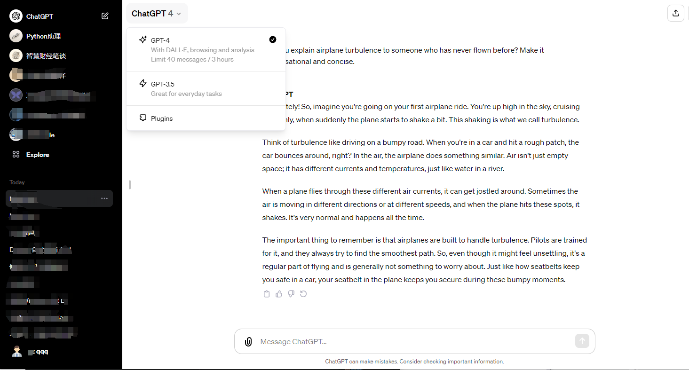
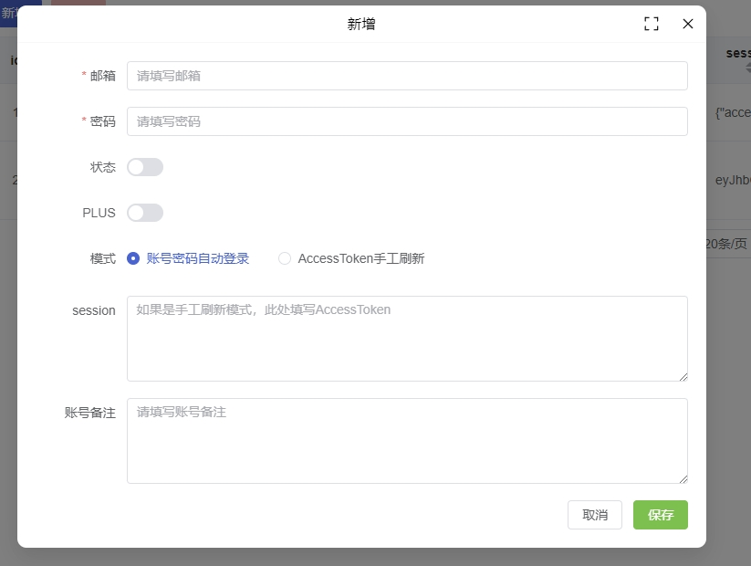
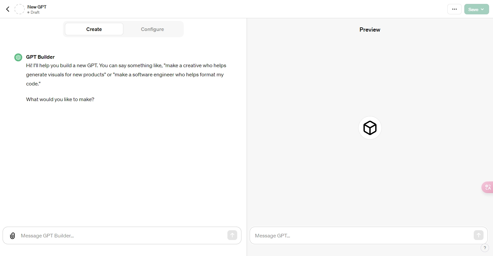
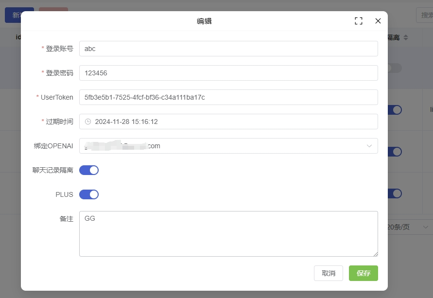
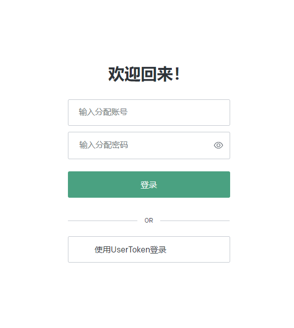

# 项目名称

## 简介

本项目是基于 [xyhelper.cn](https://xyhelper.cn/) 的二次开发版本。感谢原作者的辛苦付出，我们在此基础上进行了扩展和优化。请支持原作者，给他们的项目加星标(star)。

**注意：** 本项目目前尚未开放全部源码，将会逐步开放。

## 部署指南

### 一键部署

使用 Docker Compose 进行部署。你可以通过以下命令启动项目：

```bash
docker-compose up -d
```

更新版本：

```bash
docker-compose pull
docker-compose up -d
```

### 访问与管理

部署完成后，访问 [http://localhost:8200/xyhelper](http://localhost:8200/xyhelper) 进入管理界面。

默认管理员账号/密码：`admin/123456`

### 域名访问

请将以下内容添加到您的 Nginx 配置中，并根据您的实际情况进行适当调整（比如域名、证书路径等）：

```bash
server {
    listen 80;
    server_name example.com;  # 替换为您的域名或公网IP

    location / {
        proxy_pass http://localhost:8200;
        proxy_http_version 1.1;
        proxy_set_header Upgrade $http_upgrade;
        proxy_set_header Connection 'upgrade';
        proxy_set_header Host $host;
        proxy_cache_bypass $http_upgrade;
    }
}
```


## 功能介绍

**更新日期：2023-11-29**

1. 管理系统支持账号密码自动登录（完全托管），及手工刷新授权的第三方账号登录（当前不支持自动化）。
2. 账号管理功能，允许分配特定账号通过指定的ChatGPT账号进行操作。
3. 用户只需使用分配的账号登录即可。

## 系统优点

1. 绕过Cloudflare检测，流畅无阻。
2. 终端用户无需使用代理工具（服务器端可以配置Clash等服务）。

## 待办事项
- [ ] 实现每个分享账号的会话隔离，确保聊天记录互不干扰。
- [ ] oem配置化，通过后台配置。

## 美图欣赏
 
 
 
 



## 开源计划：
本周内完成源代码全部开源，大家可以下载自由编译，自由修改，自由贴牌

## 免责声明

使用本系统导致账号被封禁，开发者不承担任何责任。如有担忧，请勿安装使用。

## 其他

哎，本人封号，没办法只好自己开个仓库自己玩了