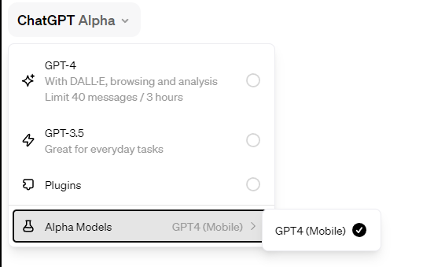
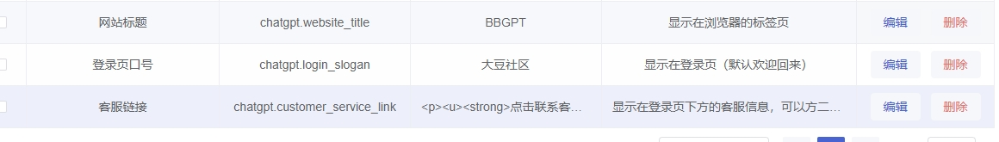

# 项目名称

## 简介

本项目是基于 [xyhelper.cn](https://xyhelper.cn/) 的二次开发版本。感谢原作者的辛苦付出，我们在此基础上进行了扩展和优化。请支持原作者，给他们的项目加星标(star)。

**注意：** 本项目目前尚未开放全部源码，将会逐步开放。

## 部署指南

### 一键部署

使用 Docker Compose 进行部署。你可以通过以下命令启动项目：

```bash
docker-compose up -d
```

更新版本：

```bash
docker-compose pull
docker-compose up -d
```

### 访问与管理

部署完成后，访问 [http://localhost:8200/xyhelper](http://localhost:8200/xyhelper) 进入管理界面。

默认管理员账号/密码：`admin/123456`

### 域名访问

请将以下内容添加到您的 Nginx 配置中，并根据您的实际情况进行适当调整（比如域名、证书路径等）：

```bash
server {
    listen 80;
    server_name example.com;  # 替换为您的域名或公网IP

    location / {
        proxy_pass http://localhost:8200;
        proxy_http_version 1.1;
        proxy_set_header Upgrade $http_upgrade;
        proxy_set_header Connection 'upgrade';
        proxy_set_header Host $host;
        proxy_cache_bypass $http_upgrade;
    }
}
```


## 特别说明
本系统完全基于xyhelper.cn进行开发，希望大家多去买他们的服务


## 系统优点

1. 支持动态配置账户会话隔离
2. 支持品牌信息配置
3. 和原版有点不同，这边是用户绑定opneai账号
4. mobile的支持，低调使用，等于3小时80次


## 待办事项
- [ ] 支持GPS的sidebar的账户隔离，每个用户自己管理sidebar
- [ ] 支持独立配置账户使用频率（每日聊天次数/每小时聊天次数）
- [ ] 支持完全独立配置网关，只要主机支持访问XXGPT或者配置PROXY 就可以进行访问 (内置绕行cf 5秒盾)
- [x] 支持openai账号的token自动刷新机制，可以定时自动刷新(仅支持账号+密码登录模式)
- [x] 支持share


**更新日期：2024-01-2**
- 自动同步栋哥的UI和静态文件，同时支持定时自动同步
- 支持【GPT4-MOBILE】 。经过测试mobiel和web是分开计时间的(等于变相3小时/80次)
- 建议使用七牛云加速栋哥的静态资源


**更新日期：2023-12-4**
- 支持CDN加速，可以使用环境变量：  STATIC_CDN_URL 进行静态资源加速
- 修复部分文件url没有走cdn加速的问题
- 支持文件系统CDN加速，建议使用七牛云加速```files.oaiusercontent.com``` ，加速后配置 环境变量 CDNHOST 进行代理文件上传，图片读取


**更新日期：2023-11-30 下午**
- 支持share链接，只是自定义share按钮文本
- 后台-系统管理-参数列表，增加如下参数：```chatgpt.share_button_text```
- 建议设置成富文本，支持字体加粗


**更新日期：2023-11-30**
1. 支持动态配置账户会话隔离
2. 支持品牌信息配置
3. 后台-系统管理-参数列表，新增如下3个参数：
- chatgpt.website_title
- chatgpt.login_slogan
- chatgpt.customer_service_link
 


**更新日期：2023-11-29**
1. 绕过Cloudflare检测，流畅无阻。
2. 终端用户无需使用代理工具（服务器端可以配置Clash等服务）。


## 美图欣赏
 
 
 
 


## 开源计划：
本周内完成源代码全部开源，大家可以下载自由编译，自由修改，自由贴牌

## 免责声明

使用本系统导致账号被封禁，开发者不承担任何责任。如有担忧，请勿安装使用。

## 其他

哎，本人封号，没办法只好自己开个仓库自己玩了
